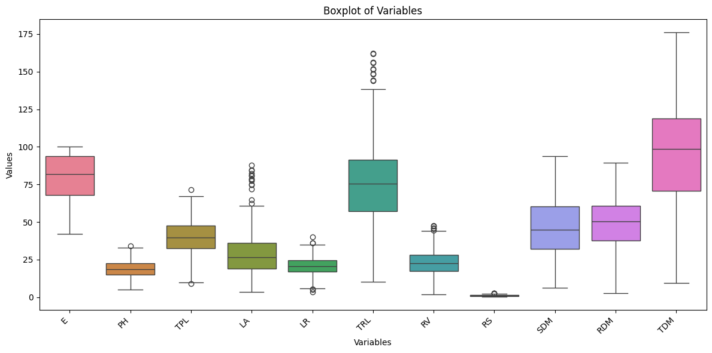

# A dataset of 15 corn hybrids subjected to abiotic stresses of water, salt, and aluminum toxicity

**Abstract:**

Maize (Zea mays L.) is one of the world's main cereal crops, being widely used for human consumption, animal feed formulation, and in the production of biofuels, starch and petroleum industries. However, abiotic stresses such as drought, salinity, and aluminum toxicity have often limited crop development and yield. These stresses can also alter soil conditions, which can negatively impact the germination process and early growth of maize plants. These adverse environmental conditions affect the development of maize at various stages of plant growth; however, the initial seedling stage is one of the most vulnerable and critical growth stages in the plant's life cycle. Therefore, the search for corn genotypes tolerant to abiotic stresses is a strategy to ensure food security and the sustainability of agricultural production in tropical soils. This study presents a dataset of 15 maize hybrids, with a focus on their morphological responses under drought, salinity, and aluminum toxicity conditions. The dataset includes comprehensive measurements such as emergence rate (E), plant height (PH), length of the longest root (LR), total plant length (TPL), total root system length (TRL), root volume (RV), leaf area (LA), shoot dry matter (SDM), root dry matter (RDM), total plant dry matter (TDM), and root to shoot ratio (RS) under non-stressful (control) and stressful (drought, salinity and aluminum toxicity) conditions. The analysis of the data from this research allows for a better understanding of the genetic and phenotypic responses of corn plants associated with tolerance to abiotic stresses. This dataset provides a basis for further exploration of abiotic stress tolerance mechanisms in maize and opens new avenues for improving agricultural sustainability. Understanding the underlying mechanisms of tolerance in these hybrids will provide valuable insights for developing breeding strategies aimed at improving maize adaptation to challenging environments.

**Authors:**
* Sthela Silva Melo 1
* Ruth Teles Barbosa 2
* Bruno Rodrigues de Oliveira 3,a
* Jorge González Aguilera 1
* Alan Mario Zuffo 4
* Fábio Steiner 1,2,a

**Address:**
* 1 State University of Mato Grosso do Sul (UEMS), Cassilândia, MS, Brazil.
* 2 State University of Mato Grosso do Sul (UEMS), Aquidauana, MS, Brazil.
* 3 Pantanal Editora, Nova Xavantina, MT, Brazil.
* 4 State University of Maranhão (UEMA), Balsas, MA, Brazil.
* a Correspondence: steiner@uems.br; bruno@editorapantanal.com.br

